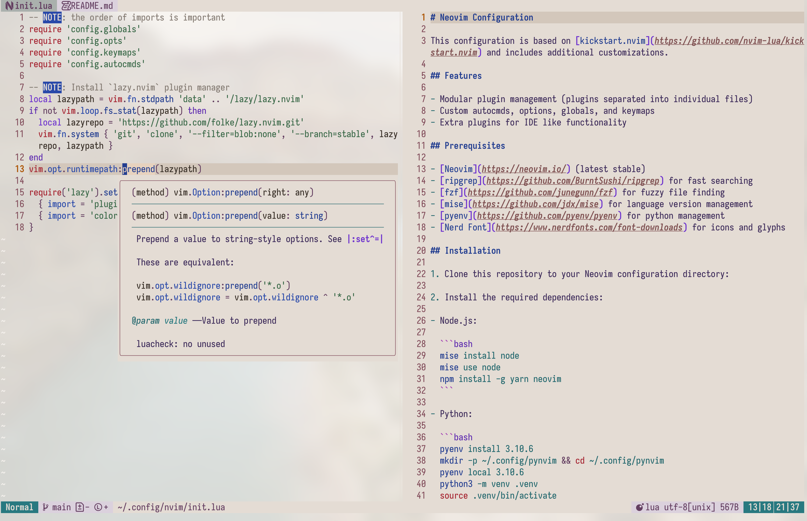
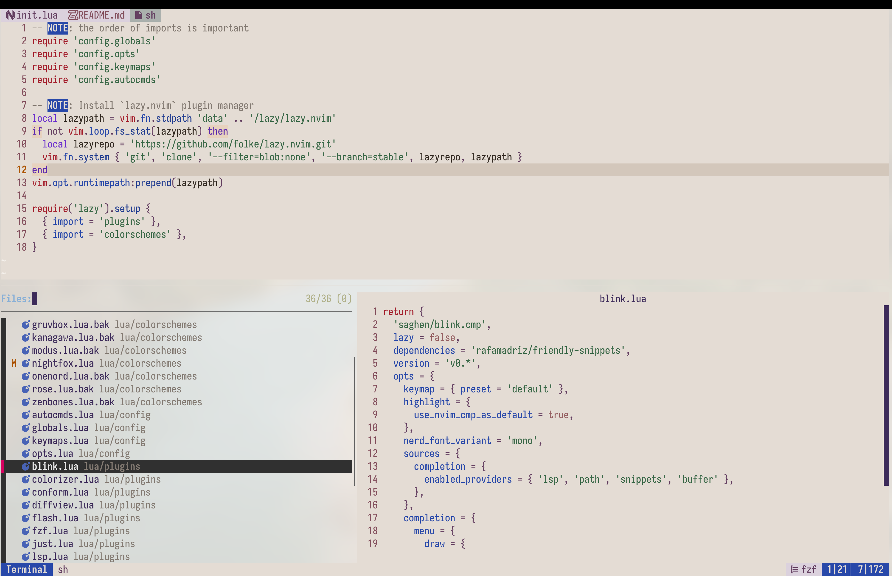
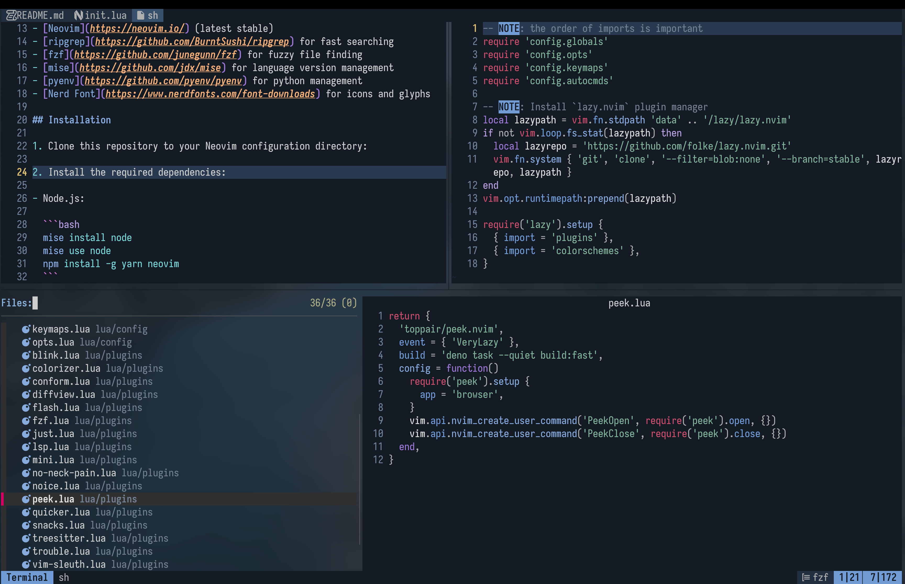
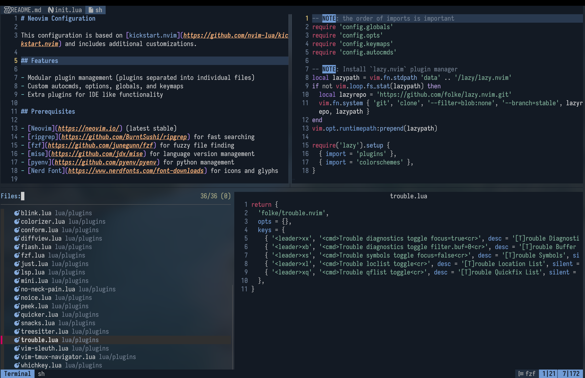

# Neovim Configuration

This configuration is based on [kickstart.nvim](https://github.com/nvim-lua/kickstart.nvim) and includes additional customizations.

## Features

- Modular plugin management (plugins separated into individual files)
- Custom autocmds, options, globals, and keymaps
- Extra plugins for IDE like functionality

## Prerequisites

- [Neovim](https://neovim.io/) (latest stable)
- [ripgrep](https://github.com/BurntSushi/ripgrep) for fast searching
- [fzf](https://github.com/junegunn/fzf) for fuzzy file finding
- [mise](https://github.com/jdx/mise) for language version management
- [pyenv](https://github.com/pyenv/pyenv) for python management
- [Nerd Font](https://www.nerdfonts.com/font-downloads) for icons and glyphs

## Installation

1. Clone this repository to your Neovim configuration directory:

2. Install the required dependencies:

- Node.js:

  ```bash
  mise install node
  mise use node
  npm install -g yarn neovim
  ```

- Python:

  ```bash
  pyenv install 3.10.6
  mkdir -p ~/.config/pynvim && cd ~/.config/pynvim
  pyenv local 3.10.6
  python3 -m venv .venv
  source .venv/bin/activate
  pip install --upgrade pip pynvim
  ```

- Deno:
  ```bash
  mise install deno
  mise use deno
  ```

3. Launch Neovim and let it install the plugins automatically.

## Health Check

Run `:checkhealth` in Neovim and ensure the following are working correctly:

- clipboard
- git
- python support
- nodejs support

## Plugin List

```bash
  Total: 33 plugins

  Loaded (26)
    ● blink.cmp 4.6ms  start
    ● conform.nvim 0.77ms  start
    ● corn.nvim 0.67ms  nvim-lspconfig
    ● fidget.nvim 3.78ms  nvim-lspconfig
    ● flash.nvim 0.92ms  VeryLazy
    ● friendly-snippets 0.13ms  blink.cmp
    ● lazy.nvim 7.73ms  init.lua
    ● lsp-inlayhints.nvim 0.57ms  nvim-lspconfig
    ● mason-lspconfig.nvim 0.12ms  nvim-lspconfig
    ● mason-tool-installer.nvim 2.25ms  nvim-lspconfig
    ● mason.nvim 0.13ms  nvim-lspconfig
    ● mini.nvim 3.84ms  start
    ● neodev.nvim 0.71ms  nvim-lspconfig
    ● nightfox.nvim 2.42ms  start
    ● noice.nvim 0.96ms  VeryLazy
    ● nui.nvim 0.19ms  noice.nvim
    ● nvim-colorizer.lua 1.73ms  VeryLazy
    ● nvim-lspconfig 14.33ms  start
    ● nvim-treesitter 6.64ms  start
    ● nvim-treesitter-textobjects 4.49ms  nvim-treesitter
    ● peek.nvim 0.58ms  VeryLazy
    ● quicker.nvim 1.07ms  start
    ● vim-just 0.07ms  BufReadPre
    ● vim-sleuth 0.37ms  start
    ● vim-tmux-navigator 0.14ms  start
    ● which-key.nvim 0.51ms  VeryLazy

  Not Loaded (7)
    ○ diffview.nvim  <leader>gh  <leader>gd  <leader>gc
    ○ fzf-lua  <leader>fr  <leader>f.  <leader><leader>  <leader>fb  ,r  <leader>fp  ,,  <C-P>  <leader>ff  <leader>fn  <leader>fg  <leader>f/  <leader>fh  <leader>fd  <leader>fw
    ○ mini.icons  fzf-lua
    ○ no-neck-pain.nvim  <leader>nn  <leader>nu  <leader>nd
    ○ plenary.nvim  diffview.nvim
    ○ snacks.nvim  <leader>gb  <leader>gB  <leader>un
    ○ trouble.nvim  <leader>xx  <leader>xb  <leader>xs  <leader>xl  <leader>xq
```

## Customization

- Add or modify plugins in `lua/plugins/`
- Adjust config in `lua/config/*.lua`

## Troubleshooting

If you encounter any issues:

1. Ensure all prerequisites are installed
2. Run `:checkhealth` and address any errors

## Screenshots





