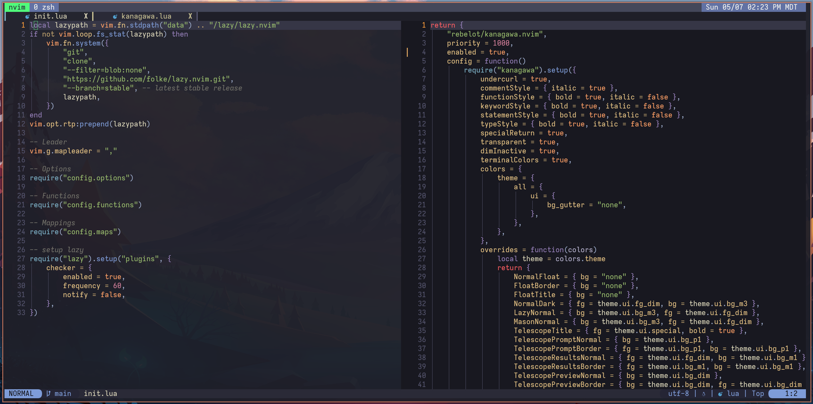
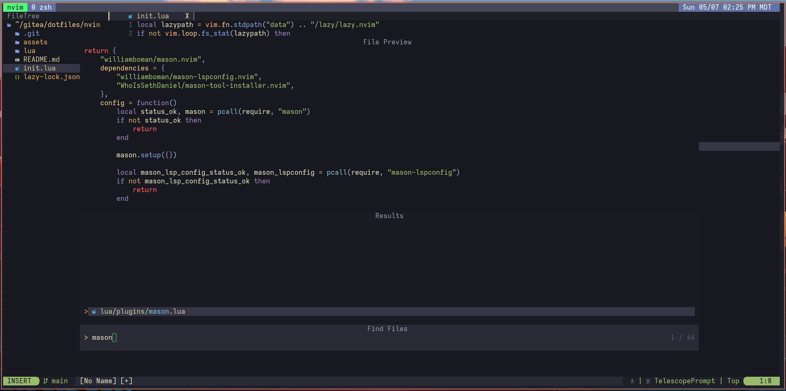

# nvim

## Notes

- `,` leader key

## Plugins

Output of `:Lazy show`

```bash
  Total: 56 plugins

  Loaded (30)
    ● LspUI.nvim 2.04ms  VeryLazy
    ● LuaSnip 3.89ms  start
    ● barbar.nvim 2.33ms  start
    ● cmp-nvim-lsp 0.1ms   nvim-lspconfig
    ● diffview.nvim 1.99ms  VeryLazy
    ● gitsigns.nvim 1.22ms  start
    ● hop.nvim 0.33ms  start
    ● indent-blankline.nvim 0.3ms  start
    ● kanagawa.nvim 1.36ms  start
    ● lazy.nvim 2.54ms   init.lua
    ● lualine-lsp-progress 0.07ms   lualine.nvim
    ● lualine.nvim 2.6ms  start
    ● mason-lspconfig.nvim 0.05ms   mason.nvim
    ● mason-tool-installer.nvim 0.42ms   mason.nvim
    ● mason.nvim 6.15ms  start
    ● mini.comment 0.22ms  start
    ● mini.pairs 0.48ms  start
    ● mini.surround 0.26ms  start
    ● neoscroll.nvim 0.29ms  start
    ● null-ls.nvim 0.45ms  start
    ● nvim-colorizer.lua 0.96ms  VeryLazy
    ● nvim-lspconfig 2.72ms   mason.nvim
    ● nvim-treesitter 8.3ms  start
    ● nvim-ts-context-commentstring 0.25ms  VeryLazy
    ● nvim-web-devicons 0.11ms   lualine.nvim
    ● nvim-window-picker 0.24ms  start
    ● plenary.nvim 0.07ms  start
    ● quickfix-reflector.vim 0.17ms  VeryLazy
    ● toggleterm.nvim 1.01ms  VeryLazy
    ● vim-tmux-navigator 0.15ms  start

  Not Loaded (22)
    ○ cmp-buffer   nvim-cmp
    ○ cmp-nvim-lsp-signature-help   nvim-cmp
    ○ cmp-nvim-lua   nvim-cmp
    ○ cmp-path   nvim-cmp
    ○ cmp-rg   nvim-cmp
    ○ cmp_luasnip   nvim-cmp
    ○ crates.nvim   rust toml
    ○ friendly-snippets   nvim-cmp
    ○ lsp-format.nvim   rust-tools.nvim
    ○ lspkind.nvim   nvim-cmp
    ○ markdown-preview.nvim   markdown
    ○ mini.trailspace   <leader>tw
    ○ neo-tree.nvim   <leader>e
    ○ nui.nvim   neo-tree.nvim
    ○ nvim-cmp  InsertEnter
    ○ nvim-dap   <leader>db <leader>dus
    ○ obsidian.nvim   <leader>sn <leader>nn
    ○ rust-tools.nvim   rust
    ○ rust.vim   rust
    ○ telescope-fzf-native.nvim   telescope.nvim
    ○ telescope-zoxide   telescope.nvim
    ○ telescope.nvim   <C-P> <leader>, <leader>gs <leader>fh    <leader>fj <c-]> <leader>cd gr <leader>xd <leader>xw

  Disabled (4)
    ○ catppuccin 
    ○ gruvbox.nvim 
    ○ nightfox.nvim 
    ○ solarized.nvim 23, and they currently have 1.5 years of runway with m
```

## Screenshots




