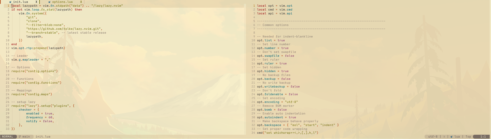
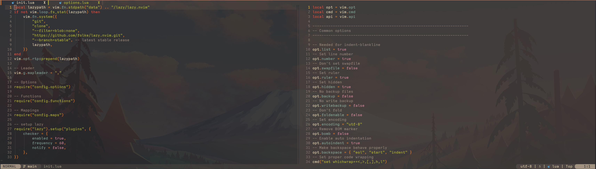

# nvim

## Notes

- `,` leader key

## Plugins

Output of `:Lazy show`

```
  Total: 57 plugins

  Loaded (33)
    ● LspUI.nvim 0.6ms  VeryLazy
    ● LuaSnip 3.03ms  start
    ● barbar.nvim 2.32ms  start
    ● cmp-nvim-lsp 0.11ms   nvim-lspconfig
    ● diffview.nvim 1.45ms  VeryLazy
    ● fidget.nvim 0.34ms  start
    ● gitsigns.nvim 0.57ms  start
    ● gruvbox.nvim 1.96ms  start
    ● hop.nvim 0.43ms  start
    ● indent-blankline.nvim 0.71ms  start
    ● lazy.nvim 2.53ms   init.lua
    ● lualine-lsp-progress 0.06ms   lualine.nvim
    ● lualine.nvim 3.98ms  start
    ● mason-lspconfig.nvim 0.08ms   mason.nvim
    ● mason-tool-installer.nvim 0.5ms   mason.nvim
    ● mason.nvim 4.95ms  start
    ● mini.comment 0.16ms  start
    ● mini.pairs 0.6ms  start
    ● mini.surround 0.4ms  start
    ● neo-tree.nvim 10.99ms   <leader>e
    ● neoscroll.nvim 0.27ms  start
    ● nui.nvim 0.28ms   neo-tree.nvim
    ● null-ls.nvim 1.1ms  start
    ● nvim-colorizer.lua 0.74ms  VeryLazy
    ● nvim-lspconfig 1.21ms   mason.nvim
    ● nvim-treesitter 14.55ms  start
    ● nvim-ts-context-commentstring 0.23ms  VeryLazy
    ● nvim-web-devicons 0.1ms   barbar.nvim
    ● nvim-window-picker 0.21ms  start
    ● plenary.nvim 0.06ms  start
    ● quickfix-reflector.vim 0.16ms  VeryLazy
    ● toggleterm.nvim 2.15ms  VeryLazy
    ● vim-tmux-navigator 0.13ms  start

  Not Loaded (20)
    ○ cmp-buffer   nvim-cmp
    ○ cmp-nvim-lsp-signature-help   nvim-cmp
    ○ cmp-nvim-lua   nvim-cmp
    ○ cmp-path   nvim-cmp
    ○ cmp-rg   nvim-cmp
    ○ cmp_luasnip   nvim-cmp
    ○ crates.nvim   rust toml
    ○ friendly-snippets   nvim-cmp
    ○ lsp-format.nvim   rust-tools.nvim
    ○ lspkind.nvim   nvim-cmp
    ○ markdown-preview.nvim   markdown
    ○ mini.trailspace   <leader>tw
    ○ nvim-cmp  InsertEnter
    ○ nvim-dap   <leader>db <leader>dus
    ○ obsidian.nvim   <leader>sn <leader>nn
    ○ rust-tools.nvim   rust
    ○ rust.vim   rust
    ○ telescope-fzf-native.nvim   telescope.nvim
    ○ telescope-zoxide   telescope.nvim
    ○ telescope.nvim   <C-P> <leader>, <leader>gs <leader>fh    <leader>fj <c-]> <leader>cd gr <leader>xd <leader>xw

  Disabled (4)
    ○ catppuccin 
    ○ kanagawa.nvim 
    ○ nightfox.nvim 
    ○ solarized.nvim
```

## Screenshots

- Gruvbox light



- Gruvbox dark


